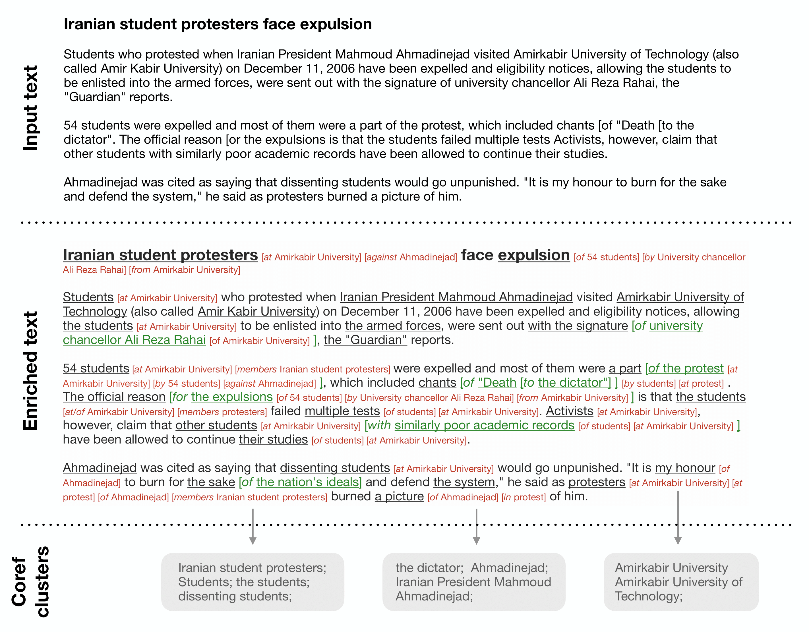
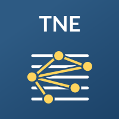
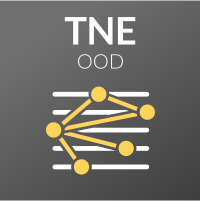

## **The Text-Based NP Enrichment Task (TNE)**

TNE is an NLU task, which focus on relations between noun phrases (NPs) that can be
mediated via prepositions. 
The dataset contains [5,497](LINK) documents, annotated exhaustively with all possible
links between the NPs in each document.

The main data comes from WikiNews, which is used for train/dev/test. We also collected an additional set of
509 documents to serve as OOD, from Books, IMDB reviews and Reddit.

This dataset was created by a team of [NLP researchers](#authors) at [Bar-Ilan University](https://biu-nlp.github.io/)
and [Allen Institute for AI](https://allenai.org/).


For more details on TNE, please refer to our [paper](#paper).  

<center>
    <a href="media/tne-figure.png"> 
        
      </a>
</center>


## **Paper**

[**Text-based NP Enrichment**](https://arxiv.org/abs/2109.12085)
Yanai Elazar, Victoria Basmov, Yoav Goldberg, Reut Tsarfaty
*arxiv, 2021*  

```markdown
@article{tne,
Author = {Yanai Elazar and Victoria Basmov and Yoav Goldberg and Reut Tsarfaty},
Title = {Text-based NP Enrichment},
Year = {2021},
Eprint = {arXiv:2109.12085},
}
```

## **Authors**
<div>
<div class="card">
  
  <div class="container">
    <a href="https://yanaiela.github.io/">
    <h4><b>Yanai Elazar</b></h4>  
    </a>
  </div>
</div>
<div class="card">
  
  <div class="container">
    <h4><b>Victoria Basmov</b></h4>
  </div>
</div>
<div class="card">
  
  <div class="container">
    <a href="https://www.cs.bgu.ac.il/~yoavg/uni/">
    <h4><b>Yoav Goldberg</b></h4>  
    </a>
  </div>
</div>
<div class="card">
  
  <div class="container">
    <a href="https://nlp.biu.ac.il/~rtsarfaty/">
    <h4><b>Reut Tsarfaty</b></h4>  
    </a>
  </div>
</div>

</div>


## **Leaderboard**

### **Submission**
Evaluating predictions for the hidden test set is done via the [AI2 Leaderboard page](https://leaderboard.allenai.org/).
Log on to the leaderboard website and follow the submission instructions.
* **[TNE Leaderboard](https://leaderboard.allenai.org/tne/)**
* **[TNE OOD Leaderboard](https://leaderboard.allenai.org/tne-ood/)**  
<a href="https://leaderboard.allenai.org/tne/">
  
</a>
<a href="https://leaderboard.allenai.org/tne-ood/">
  
</a>

## **Explore**

To view (many) more TNE examples, [explore TNE](/explore.md).

## **Download**

- For the full documentation of the dataset and its format please refer to our [Github repository](https://github.com/yanaiela/TNE).  
- Click here to [download TNE](https://github.com/yanaiela/TNE).
